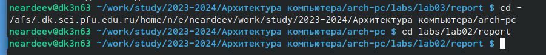

---
## Front matter
title: "Отчет по лабораторной работе №3"
subtitle: "Дисциплина: архитектура компьютера"
author: "Ардеев Никита Евгеньевич НММбд-01-23"

## Generic otions
lang: ru-RU
toc-title: "Содержание"

## Bibliography
bibliography: bib/cite.bib
csl: pandoc/csl/gost-r-7-0-5-2008-numeric.csl

## Pdf output format
toc: true # Table of contents
toc-depth: 2
lof: true # List of figures
lot: true # List of tables
fontsize: 12pt
linestretch: 1.5
papersize: a4
documentclass: scrreprt
## I18n polyglossia
polyglossia-lang:
  name: russian
  options:
	- spelling=modern
	- babelshorthands=true
polyglossia-otherlangs:
  name: english
## I18n babel
babel-lang: russian
babel-otherlangs: english
## Fonts
mainfont: PT Serif
romanfont: PT Serif
sansfont: PT Sans
monofont: PT Mono
mainfontoptions: Ligatures=TeX
romanfontoptions: Ligatures=TeX
sansfontoptions: Ligatures=TeX,Scale=MatchLowercase
monofontoptions: Scale=MatchLowercase,Scale=0.9
## Biblatex
biblatex: true
biblio-style: "gost-numeric"
biblatexoptions:
  - parentracker=true
  - backend=biber
  - hyperref=auto
  - language=auto
  - autolang=other*
  - citestyle=gost-numeric
## Pandoc-crossref LaTeX customization
figureTitle: "Рис."
tableTitle: "Таблица"
listingTitle: "Листинг"
lofTitle: "Список иллюстраций"
lotTitle: "Список таблиц"
lolTitle: "Листинги"
## Misc options
indent: true
header-includes:
  - \usepackage{indentfirst}
  - \usepackage{float} # keep figures where there are in the text
  - \floatplacement{figure}{H} # keep figures where there are in the text
---

# Цель работы

Целью работы является освоение процедуры оформления отчетов с помощью легковесного
языка разметки Markdown.

# Выполнение лабораторной работы

Я открыл терминал, перешел в каталог arch-pc,  обновил локальный репозиторий, введя git pul, перешел в каталог с шаблоном отчета по лабораторной работе №3(рис. @fig:1).

{#fig:1 width=70%}

Провожу компиляцию шаблона и проверяю корректность выполнения команды(рис. @fig:2),(рис. @fig:21). 

{#fig:2 width=70%}
{#fig:21 width=70%}
Удаляю полученные файлы и проверяю, что файлы были удалены(рис. @fig:3). 

{#fig:3 width=70%}

Открываю файл report.md  с помощью текстового редактора(рис. @fig:4).

{#fig:4 width=70%}

Я заполнил отчет и скомпилировал его с использованием Makefile. Отчет в трех форматах предоставлен
# Выполнение заданий для самостоятельной работы
Перехожу в каталог с отчетом по третьей лабораторной работе(рис. @fig:5). 

{#fig:5 width=70%}

Открыл файл с шаблоном отчета и заполнил его(рис. @fig:6). 

{#fig:6 width=70%}

Переименовал файл, в котором заполнил отчет(рис. @fig:7). 

{#fig:7 width=70%}

Компилирую отчет и проверяю, что были созданы файлы(рис. @fig:8),(рис. @fig:81).

{#fig:8 width=70%}
{#fig:81 width=70%}
Загружаю файлы на  github(рис. @fig:9). 

{#fig:9 width=70%}

 

# Выводы

Я освоил процедуры оформления отчетов с помощью легковесного языка разметки Markdown.

