---
## Front matter
title: "Отчет по лабораторной работе №4"
subtitle: "Дисциплина: архитектура компьютера"
author: "Ардеев Никита Евгеньевич НММбд-01-23"

## Generic otions
lang: ru-RU
toc-title: "Содержание"

## Bibliography
bibliography: bib/cite.bib
csl: pandoc/csl/gost-r-7-0-5-2008-numeric.csl

## Pdf output format
toc: true # Table of contents
toc-depth: 2
lof: true # List of figures
lot: true # List of tables
fontsize: 12pt
linestretch: 1.5
papersize: a4
documentclass: scrreprt
## I18n polyglossia
polyglossia-lang:
  name: russian
  options:
	- spelling=modern
	- babelshorthands=true
polyglossia-otherlangs:
  name: english
## I18n babel
babel-lang: russian
babel-otherlangs: english
## Fonts
mainfont: PT Serif
romanfont: PT Serif
sansfont: PT Sans
monofont: PT Mono
mainfontoptions: Ligatures=TeX
romanfontoptions: Ligatures=TeX
sansfontoptions: Ligatures=TeX,Scale=MatchLowercase
monofontoptions: Scale=MatchLowercase,Scale=0.9
## Biblatex
biblatex: true
biblio-style: "gost-numeric"
biblatexoptions:
  - parentracker=true
  - backend=biber
  - hyperref=auto
  - language=auto
  - autolang=other*
  - citestyle=gost-numeric
## Pandoc-crossref LaTeX customization
figureTitle: "Рис."
tableTitle: "Таблица"
listingTitle: "Листинг"
lofTitle: "Список иллюстраций"
lotTitle: "Список таблиц"
lolTitle: "Листинги"
## Misc options
indent: true
header-includes:
  - \usepackage{indentfirst}
  - \usepackage{float} # keep figures where there are in the text
  - \floatplacement{figure}{H} # keep figures where there are in the text
---

# Цель работы

Освоение процедуры компиляции и сборки программ, написанных на ассемблере NASM.

# Выполнение лабораторной работы

 Рассмотрю пример простой программы на языке ассемблера NASM. Традиционно первая
программа выводит приветственное сообщение Hello world! на экран.

Создал каталог для работы с программами на языке ассемблера NASMБ, перешел в него, в нем создал текстовый файл с именем hello.asm (рис. @fig:001).

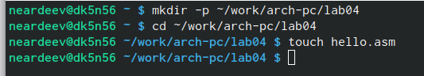{#fig:001 width=70%}

Открыл файл помощью текстового редактора gedit и ввел в него текст, представленный в лабораторной работе (рис. @fig:002).

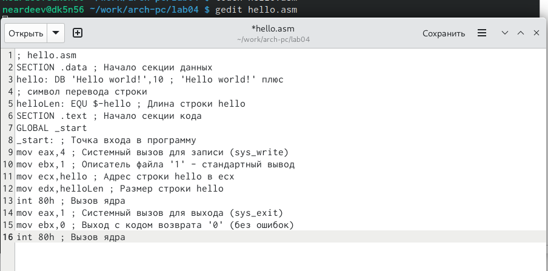{#fig:002 width=70%}

С помощью NASM превратил текст программы в объектный код и с помощью команды ls проверил, что объектный файл был создан: он имеет имя hello.o (рис. @fig:003).

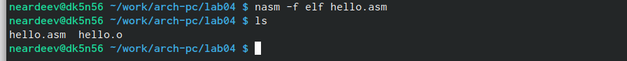{#fig:003 width=70%}

Выполнил следующую команду: nasm -o obj.o -f elf -g -l list.lst hello.asm и с ls проверил, что файлы были созданы (рис. @fig:004).

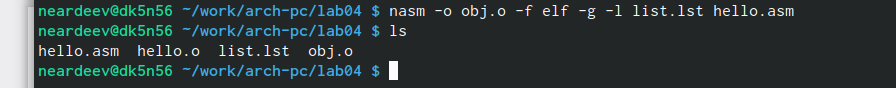{#fig:004 width=70%}

Чтобы получить исполняемую программу, объектный файл
необходимо передать на обработку компоновщику: ld -m elf_i386 hello.o -o hello, с помощью команды ls проверил, что исполняемый файл hello был создан (рис. @fig:005).

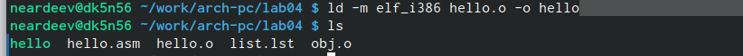{#fig:005 width=70%}

Выполнил следующую команду: ld -m elf_i386 obj.o -o main и с помощью ls выяснил, что исполняемый файл будет иметь имя main, а объектный файл - obj.o (рис. @fig:006).

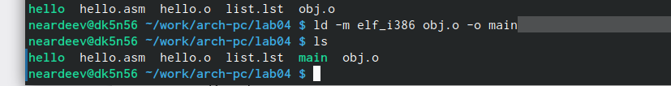{#fig:006 width=70%}

Запустил на выполнение исполняемый файл с помощью команды ./hello (рис. @fig:007).

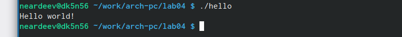{#fig:007 width=70%}

#Задание для самостоятельной работы

В каталоге ~/work/arch-pc/lab04 с помощью команды cp создал копию файла
hello.asm с именем lab4.asm (рис. @fig:008).

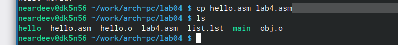{#fig:008 width=70%}

С помощью текстового редактора gedit внес изменения в текст программы в
файле lab4.asm так, чтобы вместо Hello world! на экран выводилась строка с моими
фамилией и именем. (рис. @fig:009).

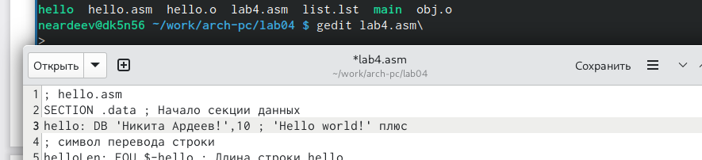{#fig:009 width=70%}

Оттранслировал полученный текст программы lab4.asm в объектный файл. Выполнил
компоновку объектного файла и запустил получившийся исполняемый файл (рис. @fig:010).

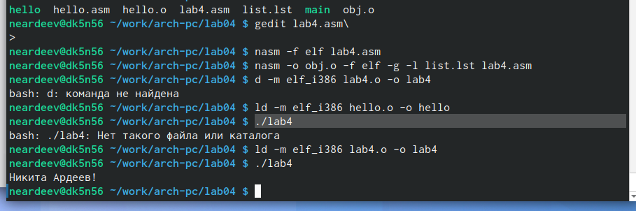{#fig:010 width=70%}

Скопировал файлы hello.asm и lab4.asm в мой локальный репозиторий в ката-
лог ~/work/study/2023-2024/"Архитектура компьютера"/arch-pc/labs/lab04/ (рис. @fig:011).

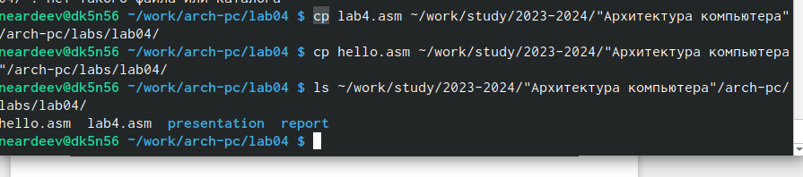{#fig:011 width=70%}

Загрузил файлы на Github. (рис. @fig:012).

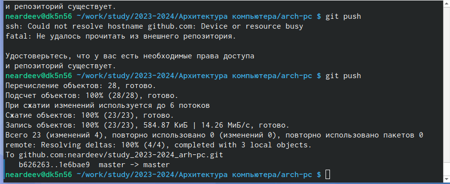{#fig:012 width=70%}

# Выводы

Получил базовые навыки в работе с ассемблером.

