---
## Front matter
title: "Лабораторная работа №5"
subtitle: "Дисциплина: архитектура компьютера"
author: "Ардеев Никита Евгеньевич НММбд-01-23"

## Generic otions
lang: ru-RU
toc-title: "Содержание"

## Bibliography
bibliography: bib/cite.bib
csl: pandoc/csl/gost-r-7-0-5-2008-numeric.csl

## Pdf output format
toc: true # Table of contents
toc-depth: 2
lof: true # List of figures
lot: true # List of tables
fontsize: 12pt
linestretch: 1.5
papersize: a4
documentclass: scrreprt
## I18n polyglossia
polyglossia-lang:
  name: russian
  options:
	- spelling=modern
	- babelshorthands=true
polyglossia-otherlangs:
  name: english
## I18n babel
babel-lang: russian
babel-otherlangs: english
## Fonts
mainfont: PT Serif
romanfont: PT Serif
sansfont: PT Sans
monofont: PT Mono
mainfontoptions: Ligatures=TeX
romanfontoptions: Ligatures=TeX
sansfontoptions: Ligatures=TeX,Scale=MatchLowercase
monofontoptions: Scale=MatchLowercase,Scale=0.9
## Biblatex
biblatex: true
biblio-style: "gost-numeric"
biblatexoptions:
  - parentracker=true
  - backend=biber
  - hyperref=auto
  - language=auto
  - autolang=other*
  - citestyle=gost-numeric
## Pandoc-crossref LaTeX customization
figureTitle: "Рис."
tableTitle: "Таблица"
listingTitle: "Листинг"
lofTitle: "Список иллюстраций"
lotTitle: "Список таблиц"
lolTitle: "Листинги"
## Misc options
indent: true
header-includes:
  - \usepackage{indentfirst}
  - \usepackage{float} # keep figures where there are in the text
  - \floatplacement{figure}{H} # keep figures where there are in the text
---

# Цель работы

Приобретение практических навыков работы в Midnight Commander. Освоение инструкций
языка ассемблера mov и int.

# Выполнение лабораторной работы

Открыл Midnight Commander с помощью команды mc(рис. @fig:001).

{#fig:001 width=70%}

Перешел в каталог ~/work/arch-pc созданный при выполнении лабораторной работы No4, создал папку lab05 и перешел в созданный каталог(рис. @fig:002).

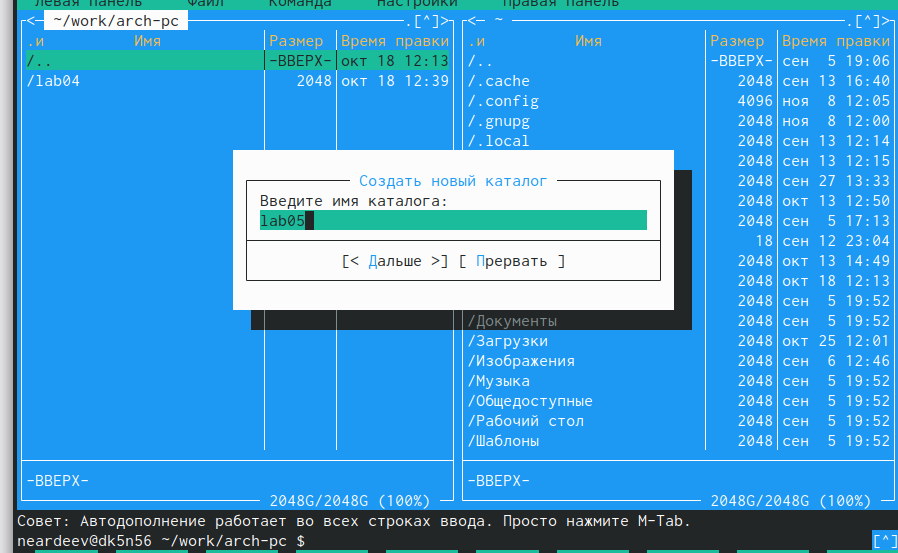{#fig:002 width=70%}

С помощью команды touch  создал файл lab5-1.asm(рис. @fig:003).

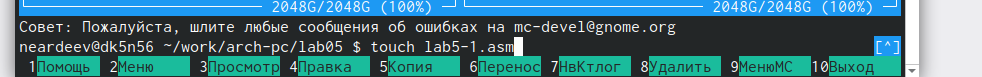{#fig:003 width=70%}

С помощью функциональной клавиши F4 открыл файл для редактированния во временном редакторе (mcedit) и ввел текст программы, затем сохранил изменния и закрыл файл(рис. @fig:004).

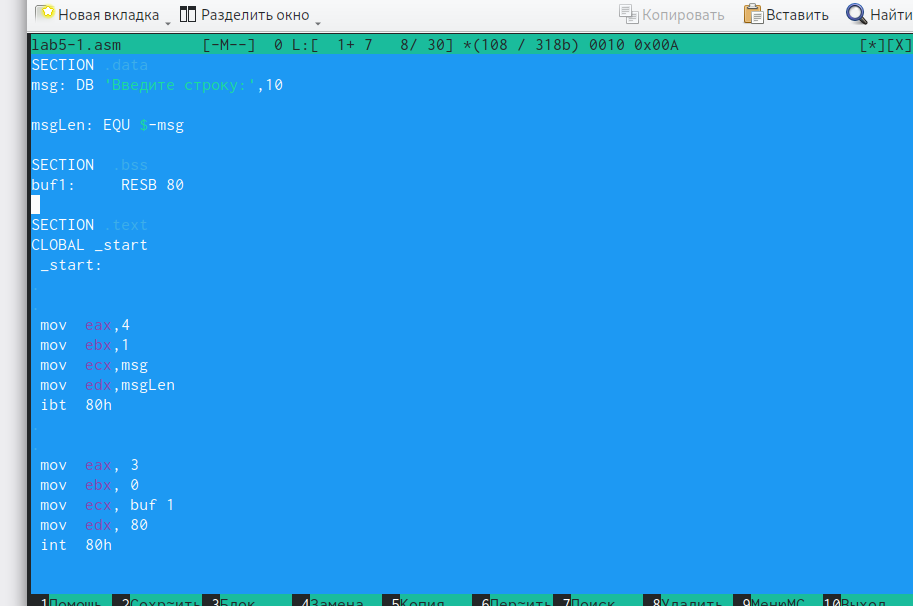{#fig:004 width=70%}

С помощью функциональной клавиши F4 убедился, что файл содержит текст программы(рис. @fig 005).

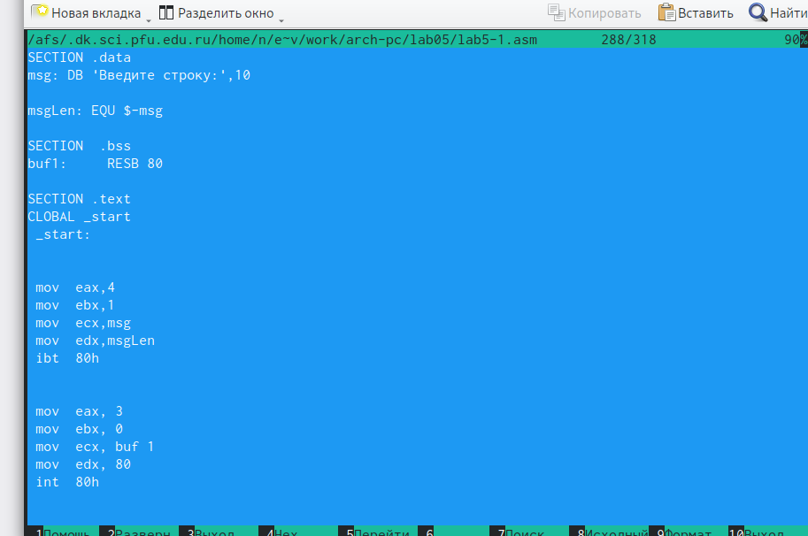{#fig:005 width=70%}

Оттранслировал текст программы lab5-1.asm в объектный файл. Выполнил компо-
новку объектного файла и запустил получившийся исполняемый файл(рис. @fig:006).

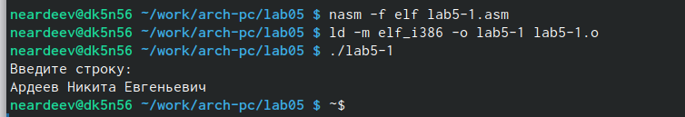{#fig:006 width=70%}

В одной из панелей mc открыл каталог с файлом lab5-1.asm. В другой панели каталог
со скаченным файлом in_out.asm. Скопировал файл in_out.asm в каталог с файлом lab5-1.asm с помощью функциональной клавиши F5(рис. @fig:007).

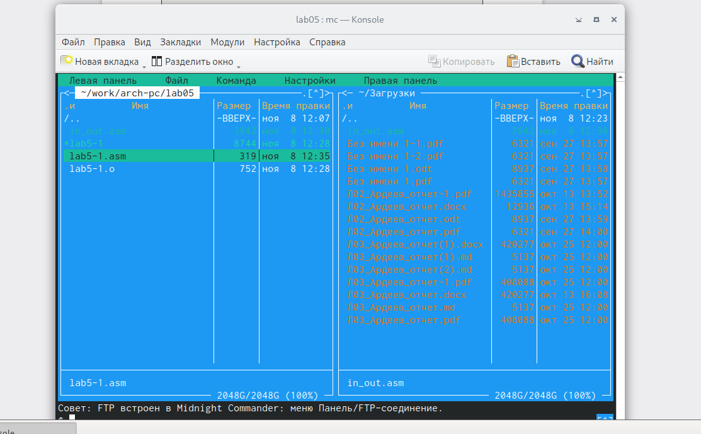{#fig:007 width=70%}

С помощью функциональной клавиши F6 создал копию файла lab5-1.asm с именем
lab5-2.asm(рис. @fig:008).

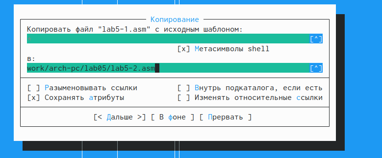{#fig:008 width=70%}

Исправил текст программы в файле lab5-2.asm с использованием подпрограмм из внешнего файла in_out.asm в соответствии с листингом 5.2. (рис. @fig:009).

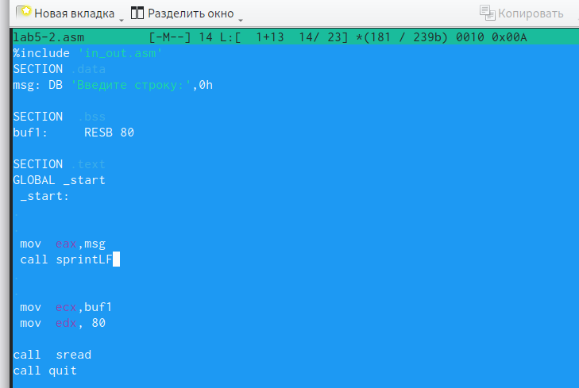{#fig:009 width=70%}

 Создал исполняемый файл и проверил его работу(рис. @fig:010).
 
 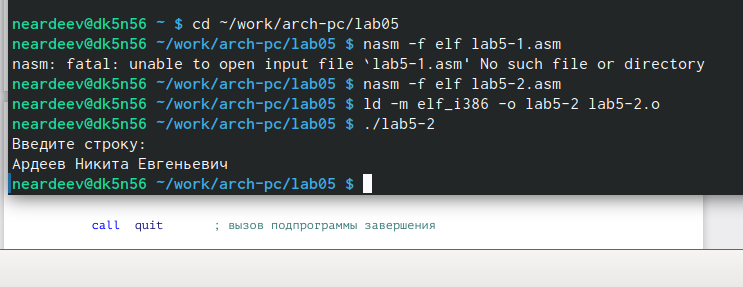{#fig:010 width=70%}
 
 В файле lab5-2.asm заменил подпрограмму sprintLF на sprint. Создал исполняемый файл и проверил его работу. Разница состоит в том, что  sprintLF позволяет вводить текст с новой строчки, а sprint - нет(рис. @fig:011).
 
 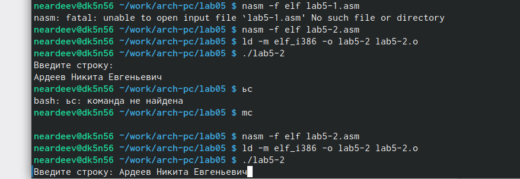{#fig:011 width=70%}
 
# Задание для самостоятельной работы
 
 Создал копию файла lab5-1.asm. Внес изменения в программу, так чтобы она работала по следующему алгоритму:
• вывести приглашение типа “Введите строку:”;
• ввести строку с клавиатуры;
• вывести введённую строку на экран. (рис. @fig:012).

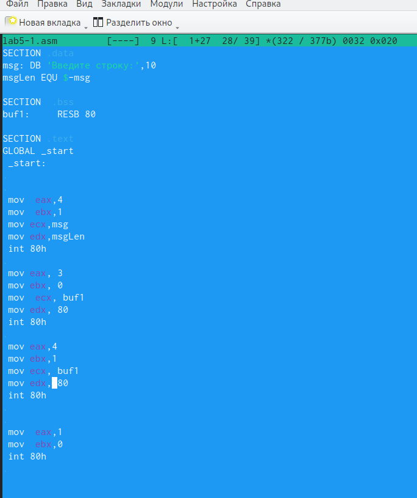{#fig:012 width=70%}

Проверил работу (рис. @fig:013).

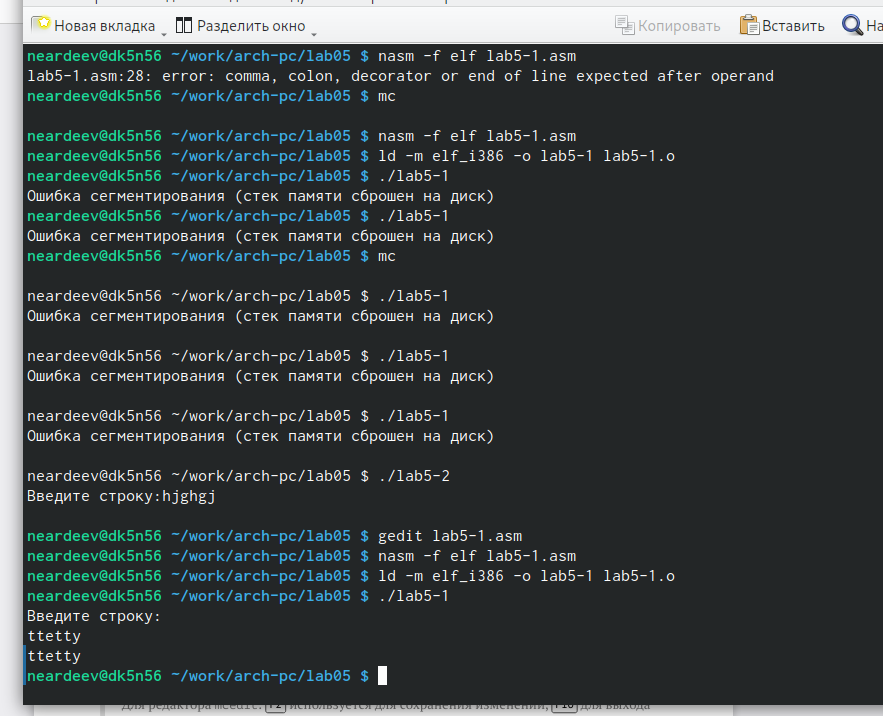{#fig:013 width=70%}

Создал копию файла lab5-2.asm. Исправил текст программы с использование под-
программ из внешнего файла in_out.asm, так чтобы она работала по аналогичному алгоритму(рис. @fig:014).

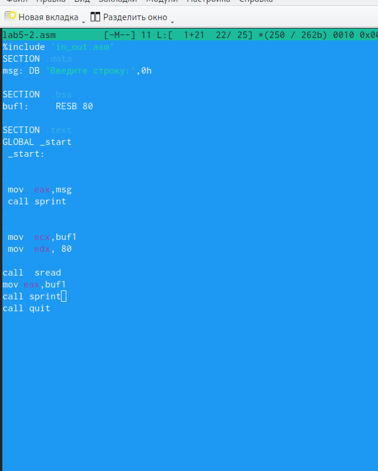{#fig:014 width=70%}

Проверил работу(рис. @fig:015).

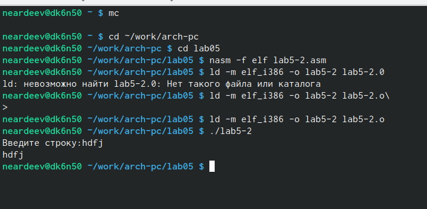{#fig:015 width=70%}
 
# Выводы

Я приобрел практические навыки в использовании Midnight Commander, научился писать базовые прогрыммы с помощью int  и mov.

