---
## Front matter
title: "Отчет по лабораторной работе №6"
subtitle: "Дисциплина: архитектура компьютера"
author: "Ардеев Никита Евгеньевич НММбд-01-23"

## Generic otions
lang: ru-RU
toc-title: "Содержание"

## Bibliography
bibliography: bib/cite.bib
csl: pandoc/csl/gost-r-7-0-5-2008-numeric.csl

## Pdf output format
toc: true # Table of contents
toc-depth: 2
lof: true # List of figures
lot: true # List of tables
fontsize: 12pt
linestretch: 1.5
papersize: a4
documentclass: scrreprt
## I18n polyglossia
polyglossia-lang:
  name: russian
  options:
	- spelling=modern
	- babelshorthands=true
polyglossia-otherlangs:
  name: english
## I18n babel
babel-lang: russian
babel-otherlangs: english
## Fonts
mainfont: PT Serif
romanfont: PT Serif
sansfont: PT Sans
monofont: PT Mono
mainfontoptions: Ligatures=TeX
romanfontoptions: Ligatures=TeX
sansfontoptions: Ligatures=TeX,Scale=MatchLowercase
monofontoptions: Scale=MatchLowercase,Scale=0.9
## Biblatex
biblatex: true
biblio-style: "gost-numeric"
biblatexoptions:
  - parentracker=true
  - backend=biber
  - hyperref=auto
  - language=auto
  - autolang=other*
  - citestyle=gost-numeric
## Pandoc-crossref LaTeX customization
figureTitle: "Рис."
tableTitle: "Таблица"
listingTitle: "Листинг"
lofTitle: "Список иллюстраций"
lotTitle: "Список таблиц"
lolTitle: "Листинги"
## Misc options
indent: true
header-includes:
  - \usepackage{indentfirst}
  - \usepackage{float} # keep figures where there are in the text
  - \floatplacement{figure}{H} # keep figures where there are in the text
---

# Цель работы

Освоение арифметических инструкций языка ассемблера NASM.

# Выполнение лабораторной работы

Создал каталог для программ лабораторной работы №6, перейдя в него создал файл lab6-1.asm(рис. @fig:001).

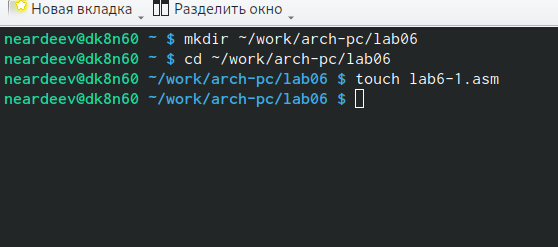{#fig:001 width=70%}

Ввел в файл lab6-1.asm текст программы из листинга(рис. @fig:002).

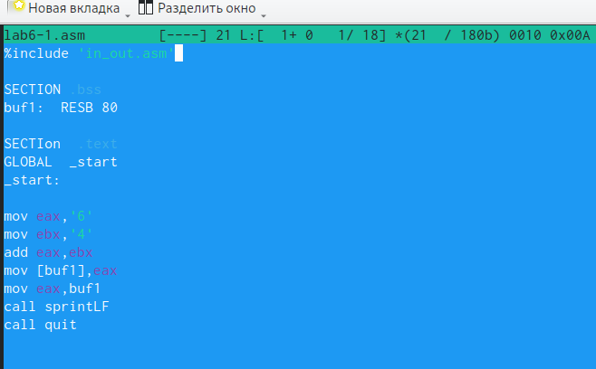{#fig:002 width=70%}

Создал исполняемый файл и запустил его(рис. @fig:003).

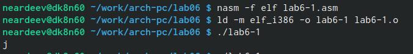{#fig:003 width=70%}

Изменил текст программы, записав числа в регистр вместо символов(рис. @fig:004).

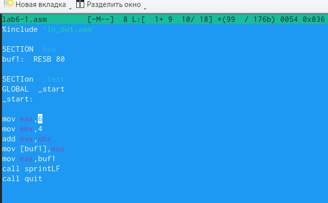{#fig:004 width=70%}

Создал исполняемый файл и запустил его. По таблице ASCII код 10 соответсвует символу Line FEED (то есть переход на новую строку, данный символ не отображается.)(рис. @fig:005).

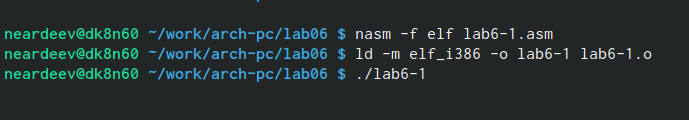{#fig:005 width=70%}

Создал файл lab6-2.asm в каталоге ~/work/arch-pc/lab06 и ввел в него текст программы из листинга(рис. @fig:006). 

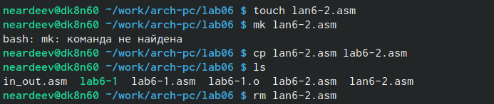{#fig:006 width=70%}

Создал исполняемый файл и запустил его(рис. @fig:007).

{#fig:007 width=70%}

Снова заменил символы на числа(рис. @fig:008).

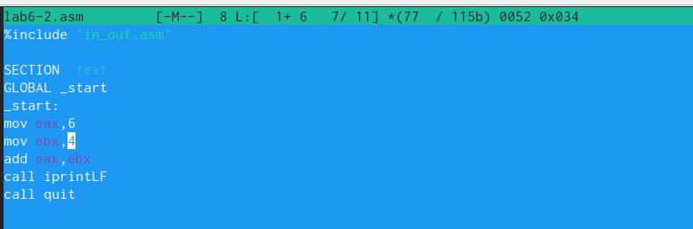{#fig:008 width=70%}

Создал исполняемый файл и запустил его. В результате вышла сумма чисел: 10(рис. @fig:009).

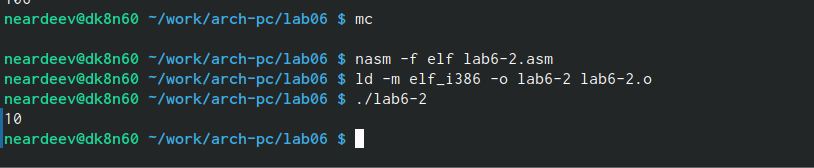{#fig:009 width=70%}

Заменил функцию iprintLF на . Создайл исполняемый файл и запустил его. iprintLF выводит результат в отдельной строке, а iprint выодит на той же строке, где предлгается ввод новой команды.(рис. @fig:010).

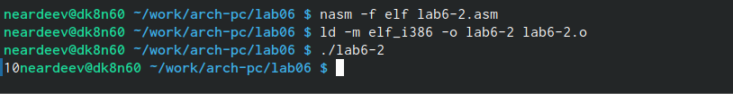{#fig:010 width=70%}

Создал файл lab6-3.asm в каталоге ~/work/arch-pc/lab06, ввел в нем текст программы из листинга, затем создал исполняемый файл и запустил его(рис. @fig:011).

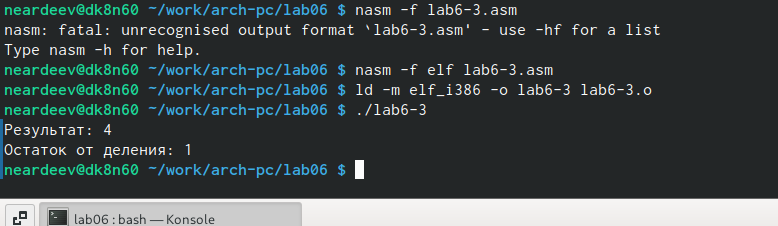{#fig:011 width=70%}

Изменил текст программы для вычисления выражения 𝑓(𝑥) = (4 ∗ 6 + 2)/5(рис. @fig:012).

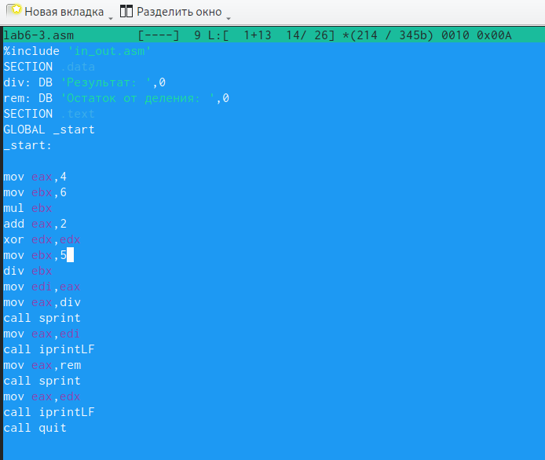{#fig:012 width=70%}

Создал исполняемый файл и запустил его(рис. @fig:013).

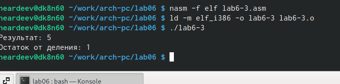{#fig:013 width=70%}

Создал файл variant.asm в каталоге ~/work/arch-pc/lab06(рис. @fig:014).

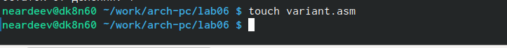{#fig:014 width=70%}

Ввел в нем текст программы из листинга,создал исполняемый файл и запустил его(рис. @fig:015).

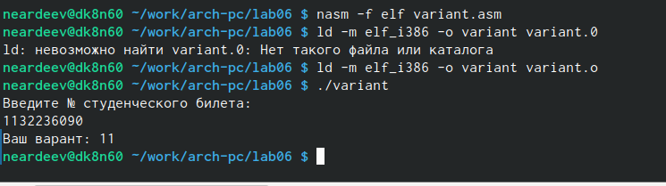{#fig:015 width=70%}
 
# Ответы на вопросы

1. mov eax,rem
call sprint.

2. Сначала определяет адрес значения "x"  в "ecx", а затем определяет длинну вводимой строки.

3. Для преобразования ACSII кода в число

4. xor edx,edx
mov ebx,20
div ebx
inc edx

5. edx

6. команда inc ebx увеличивает значение регистра edx на 1

7. mov eax,edx
call iprintLF

# Самостоятельная работа

Я написал программу для вычисления уравнения y =10(𝑥 + 1) − 10 , которая в зависимости от введенного х вычисляет его значение. Для проверки использова х1=1, х2=7(рис. @fig:016).

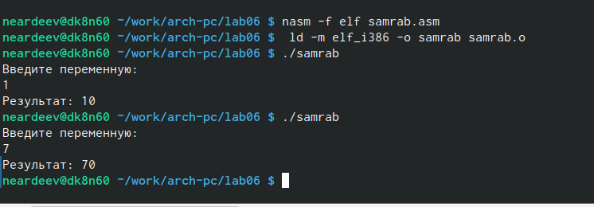{#fig:016 width=70%}

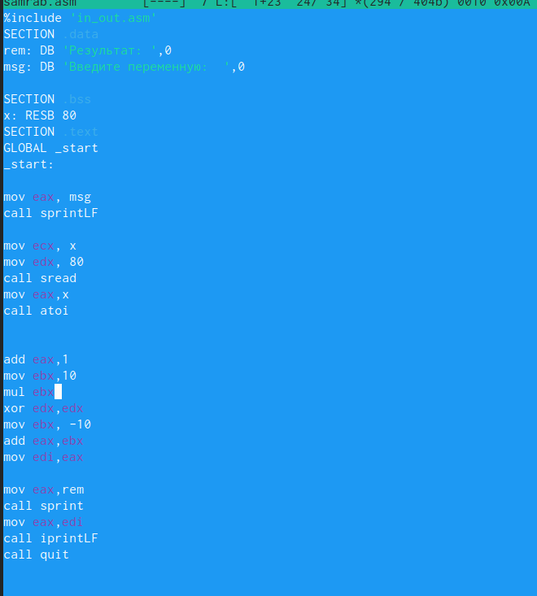{#fig:017 width=70%}

# Выводы

В ходе выполнения лабораторной работы я ознакомился с арифметическими действиями в NASM, научился составлять программу, решающую уравнение с одной переменной. 

