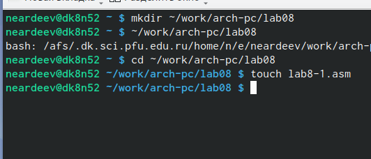
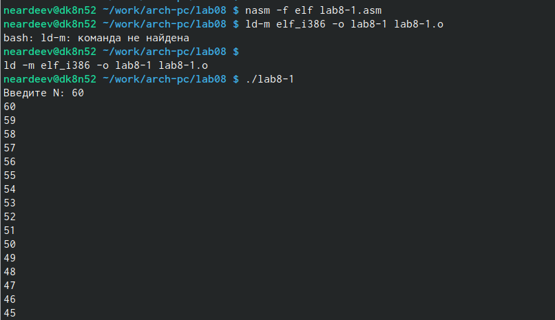
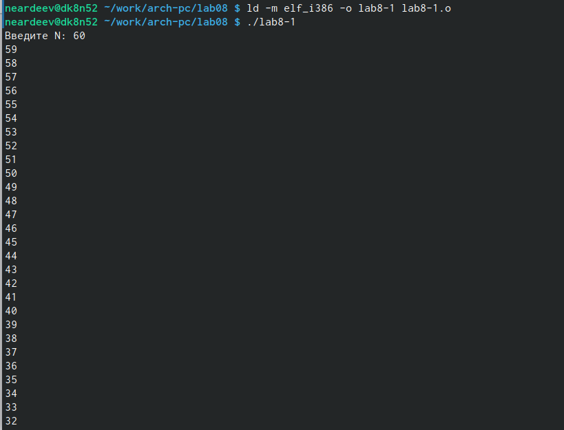
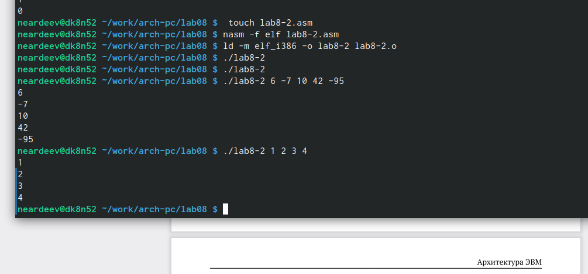
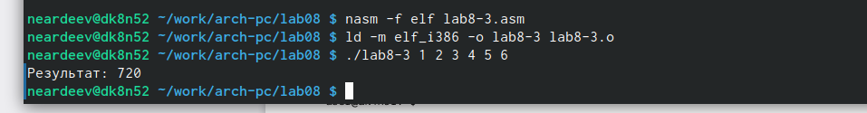
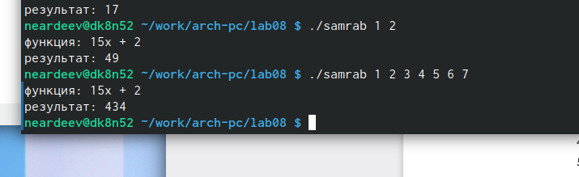

---
## Front matter
title: "Отчет по лабораторной работе №8"
subtitle: "Дисциплина: Архитектура компьютера"
author: "Ардеев Никита Евгеньевич НММбд-01-23"

## Generic otions
lang: ru-RU
toc-title: "Содержание"

## Bibliography
bibliography: bib/cite.bib
csl: pandoc/csl/gost-r-7-0-5-2008-numeric.csl

## Pdf output format
toc: true # Table of contents
toc-depth: 2
lof: true # List of figures
lot: true # List of tables
fontsize: 12pt
linestretch: 1.5
papersize: a4
documentclass: scrreprt
## I18n polyglossia
polyglossia-lang:
  name: russian
  options:
	- spelling=modern
	- babelshorthands=true
polyglossia-otherlangs:
  name: english
## I18n babel
babel-lang: russian
babel-otherlangs: english
## Fonts
mainfont: PT Serif
romanfont: PT Serif
sansfont: PT Sans
monofont: PT Mono
mainfontoptions: Ligatures=TeX
romanfontoptions: Ligatures=TeX
sansfontoptions: Ligatures=TeX,Scale=MatchLowercase
monofontoptions: Scale=MatchLowercase,Scale=0.9
## Biblatex
biblatex: true
biblio-style: "gost-numeric"
biblatexoptions:
  - parentracker=true
  - backend=biber
  - hyperref=auto
  - language=auto
  - autolang=other*
  - citestyle=gost-numeric
## Pandoc-crossref LaTeX customization
figureTitle: "Рис."
tableTitle: "Таблица"
listingTitle: "Листинг"
lofTitle: "Список иллюстраций"
lotTitle: "Список таблиц"
lolTitle: "Листинги"
## Misc options
indent: true
header-includes:
  - \usepackage{indentfirst}
  - \usepackage{float} # keep figures where there are in the text
  - \floatplacement{figure}{H} # keep figures where there are in the text
---

# Цель работы

Приобретение навыков написания программ с использованием циклов и обработкой
аргументов командной строки.

# Выполнение лабораторной работы

Создал каталог для программам лабораторной работы No 8, перешел в него и создал
файл lab8-1.asm, куда внес листинг программы(рис. [-@fig:001]) 

{ #fig:001 width=70% }

Создал исполняемый файл и проверил его работу(рис. [-@fig:002]) 

{ #fig:002 width=70% }

Изменил текст программы добавив изменение значение регистра ecx в цикле. Теперь регистр принимает каждое второе значение, т.е. N/2 (рис рис. [-@fig:003]).
{ #fig:003 width=70% }

Чтобы использовать регистрecx в цикле и сохранить корректность работы програмы, использую стек.Число проходов цикла соответствует введенному N(рис. [-@fig:004]).

{ #fig:004 width=70% }

Программа выводящая на экран аргументы командной строки, программой были обработаны все 4 введенных аргумента(рис. [-@fig:005]).

{ #fig:005 width=70% }

Программа вычисления суммы аргументов командной строки(рис.   [-@fig:006])

{ #fig:006 width=70% }

Программа вычисления произведения  аргументов командной строки(рис.   [-@fig:007])

{ #fig:007 width=70% }

# Задания для самостоятельной работы

Программу, которая находит сумму значений функции 𝑓(𝑥) для 𝑥 = 𝑥1, 𝑥2, ..., 𝑥𝑛(рис.   [-@fig:008])

{ #fig:008 width=70% }

# Выводы

В ходе этой лабораторной работы я научился задавать циклы в ассемблере. 

