---
## Front matter
title: "Отчёт по лабораторной работе №9"
subtitle: "Дисциплина: Архитектура компьютера"
author: "Ардеев Никита Евгеньевич НММбд-01-23"

## Generic otions
lang: ru-RU
toc-title: "Содержание"

## Bibliography
bibliography: bib/cite.bib
csl: pandoc/csl/gost-r-7-0-5-2008-numeric.csl

## Pdf output format
toc: true # Table of contents
toc-depth: 2
lof: true # List of figures
lot: true # List of tables
fontsize: 12pt
linestretch: 1.5
papersize: a4
documentclass: scrreprt
## I18n polyglossia
polyglossia-lang:
  name: russian
  options:
	- spelling=modern
	- babelshorthands=true
polyglossia-otherlangs:
  name: english
## I18n babel
babel-lang: russian
babel-otherlangs: english
## Fonts
mainfont: PT Serif
romanfont: PT Serif
sansfont: PT Sans
monofont: PT Mono
mainfontoptions: Ligatures=TeX
romanfontoptions: Ligatures=TeX
sansfontoptions: Ligatures=TeX,Scale=MatchLowercase
monofontoptions: Scale=MatchLowercase,Scale=0.9
## Biblatex
biblatex: true
biblio-style: "gost-numeric"
biblatexoptions:
  - parentracker=true
  - backend=biber
  - hyperref=auto
  - language=auto
  - autolang=other*
  - citestyle=gost-numeric
## Pandoc-crossref LaTeX customization
figureTitle: "Рис."
tableTitle: "Таблица"
listingTitle: "Листинг"
lofTitle: "Список иллюстраций"
lotTitle: "Список таблиц"
lolTitle: "Листинги"
## Misc options
indent: true
header-includes:
  - \usepackage{indentfirst}
  - \usepackage{float} # keep figures where there are in the text
  - \floatplacement{figure}{H} # keep figures where there are in the text
---

# Цель работы

Приобретение навыков написания программ с использованием подпрограмм. Знакомство
с методами отладки при помощи GDB и его основными возможностями.

# Выполнение лабораторной работы

Создал каталог для выполнения лабораторной работы No 9, перешел в него и создал файл lab09-1.asm, ввел в него текст программы из листинга 9.1. Создал исполняемый
файл и проверил его работу: (рис. [-@fig:001])

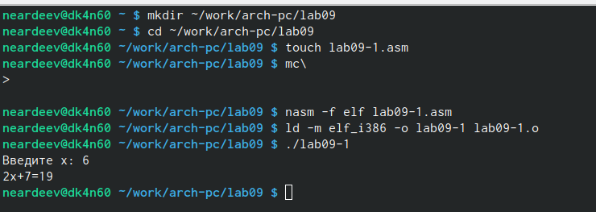{#fig:001 width=70%}

Изменил текст программы, добавив подпрограмму _subcalcul в подпрограмму _calcul,
для вычисления выражения 𝑓(𝑔(𝑥)) и проверил его работу(рис. [-@fig:002])

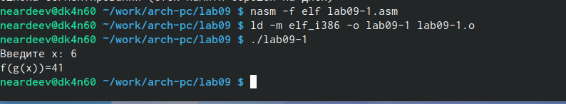{#fig:002 width=70%}

Создайте файл lab09-2.asm с текстом программы из Листинга 9.2, получил исполняемый файл.(рис. [-@fig:003)

{#fig:003 width=70%}

Добавил отладочную информацию в исполняемый файл, загрузил исполняемый файл в отладчик gdb и проверил работу программы(рис. [-@fig:004])

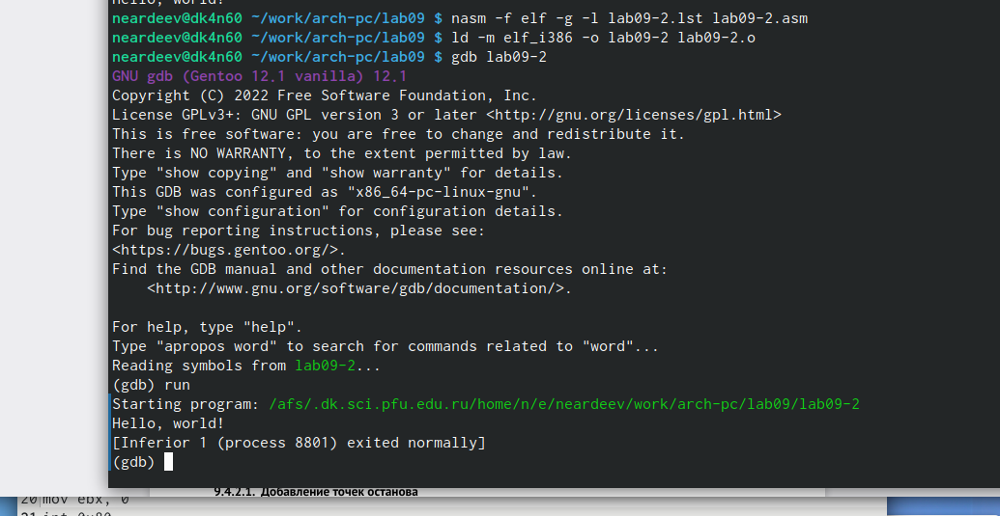{#fig:004 width=70%}

 Установил брейкпоинт на метку _start, посмотрел дисассимилированный код программы, переключился на отображение команд с Intel’овским синтаксисом. Отличие в том, что в ATT первые аргументы всех комманд записаны в виде 16-ричного числа, а в intel так записываются адреса вторых аргумантов(рис. [-@fig:005])

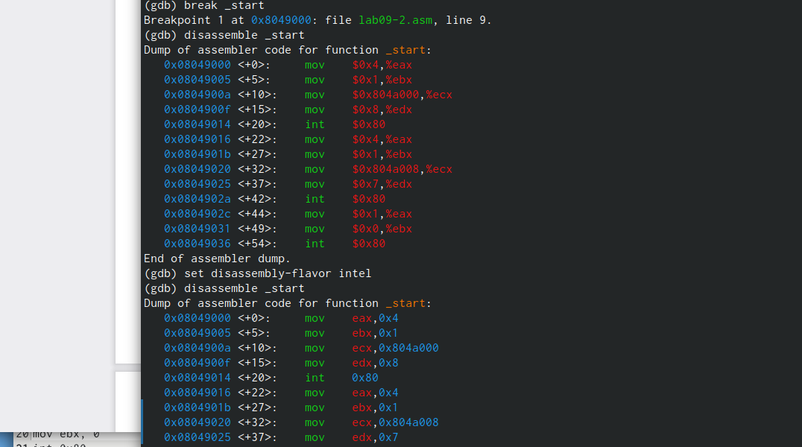{#fig:005 width=70%}

Включил режим псевдографики для более удобного анализа программы (рис. [-@fig:006])

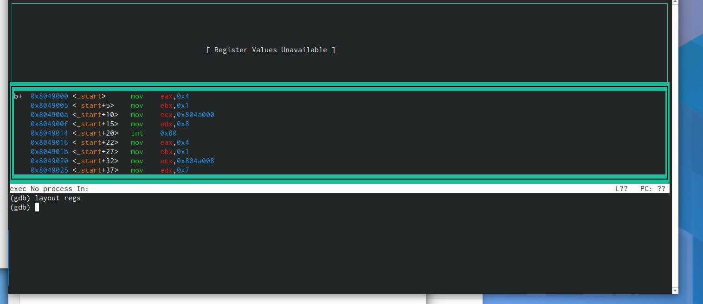{#fig:006 width=70%}

Проверил точку останова с помощью команды info breakpoints,установил еще одну точку останова по адресу инструкции, проверил это(рис. [-@fig:007])

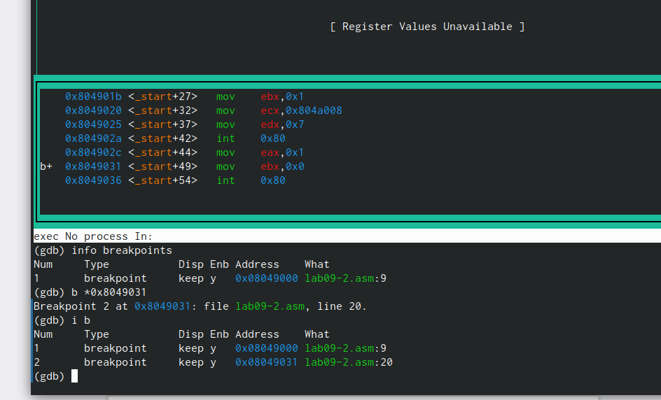{#fig:007 width=70%}

Выполнил 5 инструкций с помощью команды stepi, меняются значения регистров eax, ebx,edx,ecx, eip, проверил это с помощью команды i r(рис. [-@fig:008])

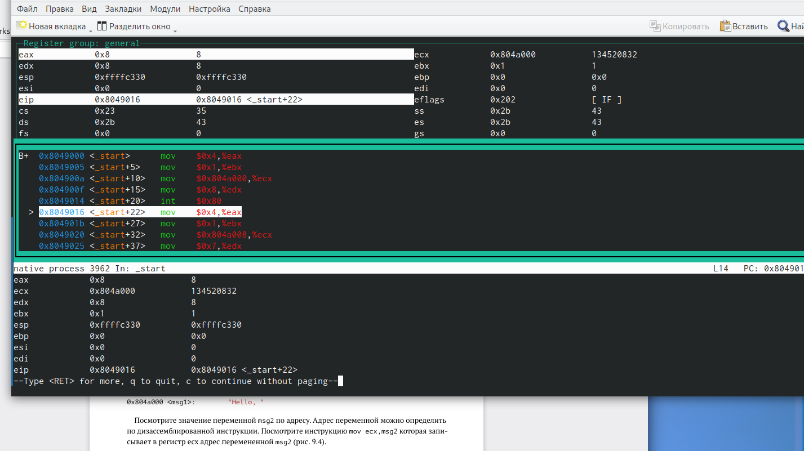{#fig:008 width=70%}

Посмотрел значение переменной msg1 по имени и значение переменной msg2 по адресу(рис. [-@fig:009])

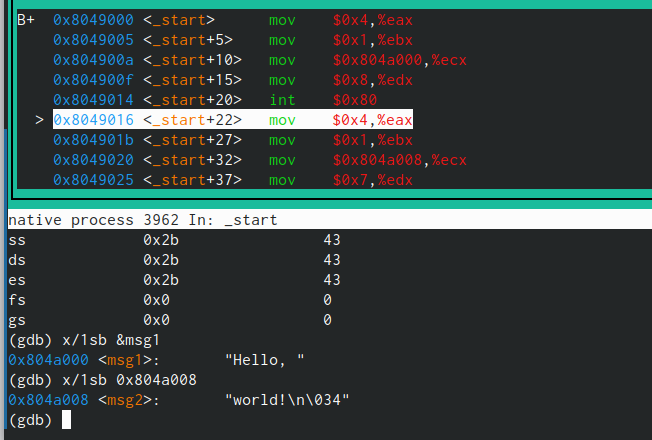{#fig:009 width=70%}

Изменил первый символ переменной msg1 (рис. [-@fig:010])

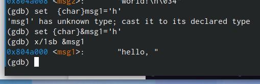{#fig:010 width=70%}

Заменил первый символ во второй переменной msg2(рис. [-@fig:011])

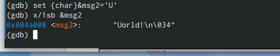{#fig:011 width=70%}

Вывел в различных форматах значение регистра edx(рис. [-@fig:012])

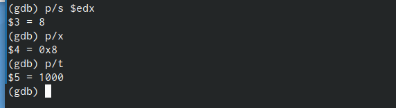{#fig:012 width=70%}

С помощью команды set изменил значение регистра ebx(рис. [-@fig:013])

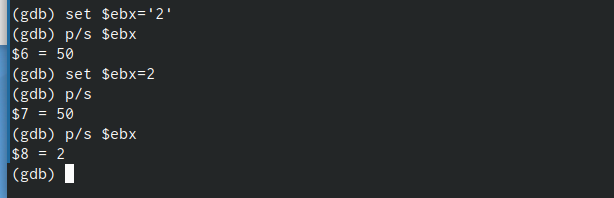{#fig:013 width=70%}

Скопировал файл lab8-2.asm, создайл исполняемый файл, загрузил исполняемый файл в отладчик, указав аргументы, создал точку останова на метке _start и запустл программу, посмотрел на содержимое того,что расположено по адрессу,  шаг изменения адреса равен 4, потому что они распологаются в 4 байтах друг от друга, а столько заниемает элемент стека (рис. [-@fig:014])

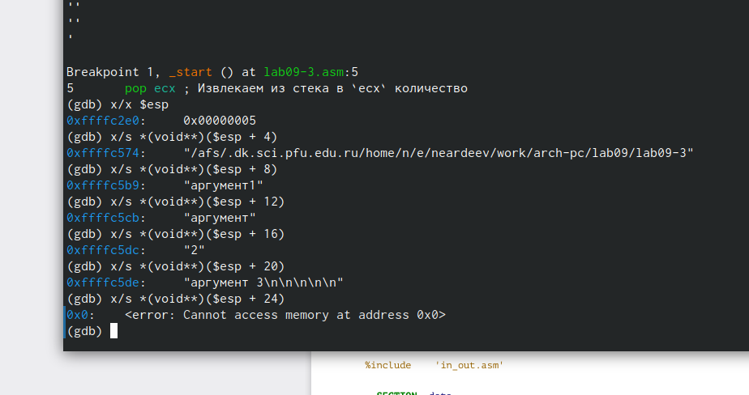{#fig:014 width=70%}


# Задания для самостоятельной работы

Программа из лабороторной 8 с использованием подпрограмм из 9-ой (рис. [-@fig:015])

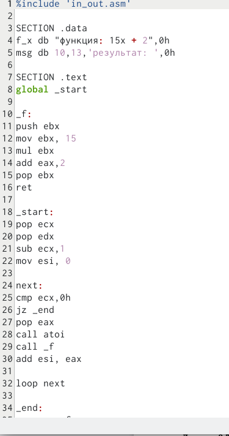{#fig:015 width=70%}

Ее работа(рис. [-@fig:016])

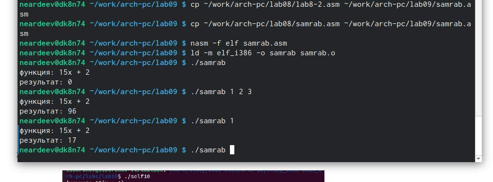{#fig:016 width=70%}

Посмотрел регистры, чтобы найти ошибку (рис. [-@fig:017])

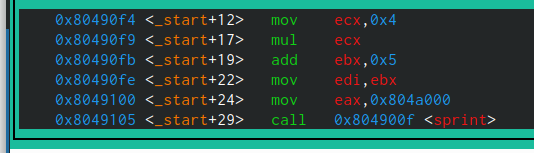{#fig:017 width=70%}

Ошибка была в сторках
```nasm
add ebx,eax
mov ecx,4
mul ecx
add ebx,5
mov edi,ebx
```

Работа правильной программы(рис. [-@fig:018])

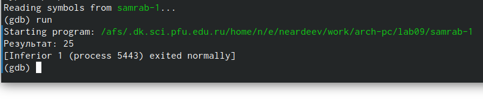{#fig:018 width=70%}

# Выводы

В результате выполнения работы, я приобрел навыки написания программ с использованием подпрограмм и познакомился с базовыми функциями отладчика gdb.
